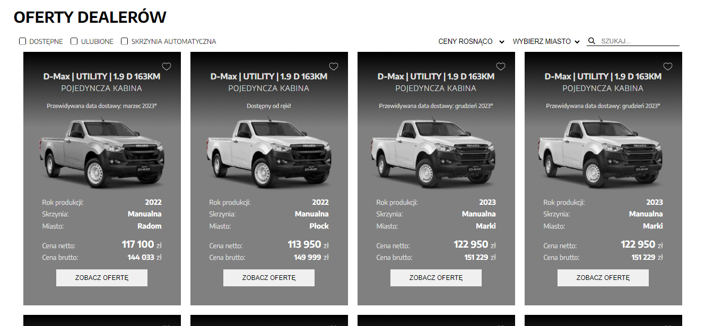
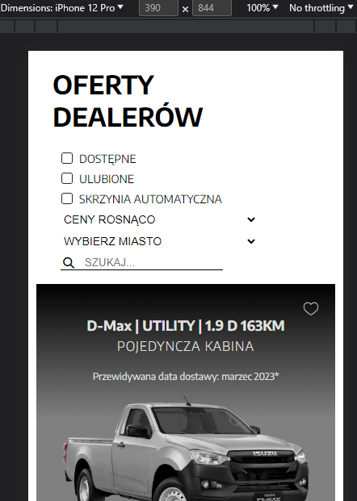
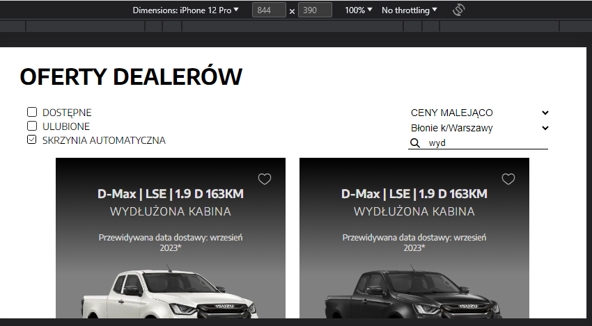

# available-cars
JS app showing cars available in dealers offers API.

## Table of contents
- [Live](#live)
- [How To Install](#how-to-install)
- [Technologies](#technologies)
- [Functionalities](#functionalities)
- [Screens](#screens)

## Live
https://zasada94.github.io/available-cars/

## How To Install

- open code editor,
- open terminal and navigate to folder where You want project copied,
- clone project through terminal with command: "git clone https://github.com/Zasada94/available-cars",
- use "cd [app_name_here]"  (change direction) command to get into apps main folder,
- start app live version with live server or by clicking on html file.
  
## Technologies

Project was created with:
- Javascript
- SCSS
- Responsive Web Design

## Functionalities

- filtering and sorting through array of cars.
- filtering with availability, autoamtic gearbox and city.
- sorting by most or least expensive ones.
- searching through cars title, description and other characteristics.

## Screens

